---

## 12. Historia de Usuario HU-05: Sistema de Permisos Granulares

### Objetivo
Control de acceso jerarquizado: Super Admin (nivel 5) > Admin (4) > Coordinador (3) > Docente (2) > Estudiante (1).

### Implementación Backend

**1. Constante de jerarquía (`applications/usuarios/models.py`)**:
```python
ROLE_HIERARCHY = {
  'super_admin': 5,
  'admin': 4,
  'coordinador': 3,
  'docente': 2,
  'estudiante': 1
}
```

**2. Método de validación**:
```python
def tiene_permiso_jerarquico(self, accion_nivel_requerido):
  """
  Valida si el usuario puede realizar una acción según jerarquía
  """
  nivel_usuario = ROLE_HIERARCHY.get(self.rol, 0)
  return nivel_usuario >= accion_nivel_requerido
```

**3. Serializer con validación (`applications/usuarios/api/serializers.py`)**:
```python
from applications.usuarios.models import ROLE_HIERARCHY

class UsuarioSerializer(serializers.ModelSerializer):
  def validate(self, data):
    request = self.context.get('request')
    if request and request.user:
      nuevo_rol = data.get('rol', self.instance.rol if self.instance else None)
      if nuevo_rol:
        nivel_usuario = ROLE_HIERARCHY.get(request.user.rol, 0)
        nivel_nuevo_rol = ROLE_HIERARCHY.get(nuevo_rol, 0)
                
        if nivel_nuevo_rol >= nivel_usuario:
          raise serializers.ValidationError({
            'rol': f'No puedes asignar un rol igual o superior al tuyo. Tu nivel: {nivel_usuario}'
          })
    return data
```

**4. ViewSet con permisos (`applications/usuarios/api/views.py`)**:
```python
from applications.usuarios.models import ROLE_HIERARCHY

class UsuarioViewSet(viewsets.ModelViewSet):
  permission_classes = [IsAuthenticated]
    
  def get_queryset(self):
    user = self.request.user
    nivel_usuario = ROLE_HIERARCHY.get(user.rol, 0)
        
    # Filtrar usuarios con nivel inferior
    roles_permitidos = [rol for rol, nivel in ROLE_HIERARCHY.items() if nivel < nivel_usuario]
    return Usuario.objects.filter(rol__in=roles_permitidos)
    
  def update(self, request, *args, **kwargs):
    # Validación adicional antes de actualizar
    instance = self.get_object()
    nuevo_rol = request.data.get('rol', instance.rol)
        
    nivel_usuario = ROLE_HIERARCHY.get(request.user.rol, 0)
    nivel_nuevo_rol = ROLE_HIERARCHY.get(nuevo_rol, 0)
        
    if nivel_nuevo_rol >= nivel_usuario:
      return Response(
        {'error': 'No tienes permiso para asignar este rol'},
        status=status.HTTP_403_FORBIDDEN
      )
        
    return super().update(request, *args, **kwargs)
```

### Implementación Frontend

**1. Hook useRoleHierarchy (`src/hooks/useRoleHierarchy.js`)**:
```javascript
export const ROLE_HIERARCHY = {
  'super_admin': 5,
  'admin': 4,
  'coordinador': 3,
  'docente': 2,
  'estudiante': 1
};

export const useRoleHierarchy = () => {
  const { user } = useAuth();
  
  const canEditRole = (targetRole) => {
  const userLevel = ROLE_HIERARCHY[user?.rol] || 0;
  const targetLevel = ROLE_HIERARCHY[targetRole] || 0;
  return userLevel > targetLevel;
  };
  
  return { canEditRole };
};
```

**2. Integración en UsuariosPage (`src/features/usuarios/pages/UsuariosPage.js`)**:
```javascript
const { canEditRole } = useRoleHierarchy();

// Filtrar roles editables
const rolesEditables = Object.keys(ROLE_HIERARCHY)
  .filter(rol => canEditRole(rol))
  .map(value => ({ value, label: value.replace('_', ' ').toUpperCase() }));

// Deshabilitar edición si no tiene permisos
const canEditUser = (usuario) => canEditRole(usuario.rol);
```

### Testing
```bash
# Backend - Validar jerarquía
python manage.py shell
>>> from applications.usuarios.models import Usuario, ROLE_HIERARCHY
>>> admin = Usuario.objects.get(email='admin@colegio.edu')
>>> admin.tiene_permiso_jerarquico(3)  # True si es admin o superior

# Frontend - Verificar filtrado de roles
# Login como admin → Ver que solo aparecen roles inferiores en dropdown
# Intentar crear super_admin → Ver error 403
```

---

## 13. Historia de Usuario HU-06: Gestión de Asignaturas

### Objetivo

CRUD completo de asignaturas con toggle de estado activo/inactivo + notificación email al docente cuando se desactiva.

### Implementación Backend

**1. Modelo Asignatura (`applications/academico/models.py`)**:

```python
class Asignatura(models.Model):
  codigo = models.CharField(max_length=10, unique=True)
  nombre = models.CharField(max_length=200)
  creditos = models.PositiveIntegerField(default=3)
  estado = models.BooleanField(default=True)  # True=Activa, False=Inactiva
  facultad = models.ForeignKey('Facultad', on_delete=models.CASCADE)
  docente_responsable = models.ForeignKey(
    'usuarios.Usuario',
    on_delete=models.SET_NULL,
    null=True,
    blank=True,
    limit_choices_to={'rol': 'docente'}
  )

  class Meta:
    ordering = ['codigo']

  def __str__(self):
    return f"{self.codigo} - {self.nombre}"
```

**2. Serializer (`applications/academico/api/serializers.py`)**:

```python
class AsignaturaSerializer(serializers.ModelSerializer):
  facultad_nombre = serializers.CharField(source='facultad.nombre', read_only=True)
  docente_nombre = serializers.SerializerMethodField()

  class Meta:
    model = Asignatura
    fields = ['id', 'codigo', 'nombre', 'creditos', 'estado',
          'facultad', 'facultad_nombre', 'docente_responsable', 'docente_nombre']

  def get_docente_nombre(self, obj):
    if obj.docente_responsable:
      return f"{obj.docente_responsable.first_name} {obj.docente_responsable.last_name}"
    return None
```

**3. ViewSet con notificación (`applications/academico/api/views.py`)**:

```python
from applications.usuarios.tasks import send_asignatura_desactivacion_email

class AsignaturaViewSet(viewsets.ModelViewSet):
  queryset = Asignatura.objects.all()
  serializer_class = AsignaturaSerializer
  permission_classes = [IsAuthenticated]

  def update(self, request, *args, **kwargs):
    instance = self.get_object()
    estado_anterior = instance.estado

    response = super().update(request, *args, **kwargs)

    # Detectar cambio de activo a inactivo
    instance.refresh_from_db()
    if estado_anterior is True and instance.estado is False:
      if instance.docente_responsable:
        send_asignatura_desactivacion_email.delay(
          docente_email=instance.docente_responsable.email,
          docente_nombre=f"{instance.docente_responsable.first_name} {instance.docente_responsable.last_name}",
          asignatura_codigo=instance.codigo,
          asignatura_nombre=instance.nombre
        )

    return response
```

**4. Celery Task para Email (`applications/usuarios/tasks.py`)**:

```python
@shared_task
def send_asignatura_desactivacion_email(docente_email, docente_nombre, asignatura_codigo, asignatura_nombre):
  """
  Envía notificación al docente cuando su asignatura es desactivada
  """
  subject = f'⚠️ Asignatura {asignatura_codigo} Desactivada'

  html_message = f"""
  <!DOCTYPE html>
  <html>
  <head>
    <meta charset="UTF-8">
    <style>
      body {{ font-family: Arial, sans-serif; line-height: 1.6; color: #333; }}
      .container {{ max-width: 600px; margin: 0 auto; padding: 20px; }}
      .header {{ background: #f44336; color: white; padding: 20px; border-radius: 5px; }}
      .content {{ padding: 20px; background: #f9f9f9; margin-top: 20px; }}
      .highlight {{ background: #fff3cd; padding: 10px; border-left: 4px solid #ffc107; }}
    </style>
  </head>
  <body>
    <div class="container">
      <div class="header">
        <h2>🔔 Notificación de Cambio de Estado</h2>
      </div>
      <div class="content">
        <p>Estimado/a <strong>{docente_nombre}</strong>,</p>
        <p>Le informamos que la asignatura bajo su responsabilidad ha sido <strong>desactivada</strong>:</p>
        <div class="highlight">
          <strong>Código:</strong> {asignatura_codigo}<br>
          <strong>Nombre:</strong> {asignatura_nombre}<br>
          <strong>Estado:</strong> ❌ INACTIVA
        </div>
        <p><strong>Implicaciones:</strong></p>
        <ul>
          <li>No aparecerá en el listado de asignaturas activas</li>
          <li>No se podrán crear nuevas matrículas</li>
          <li>Las matrículas existentes no se ven afectadas</li>
        </ul>
        <p>Si tiene alguna duda, contacte con coordinación académica.</p>
        <hr>
        <p style="font-size: 12px; color: #666;">
          Este es un mensaje automático del Sistema de Gestión Académica.<br>
          Por favor no responda a este correo.
        </p>
      </div>
    </div>
  </body>
  </html>
  """

  send_mail(
    subject=subject,
    message='',  # Texto plano vacío
    from_email=settings.EMAIL_HOST_USER,
    recipient_list=[docente_email],
    html_message=html_message,
    fail_silently=False
  )

  return f'Email enviado a {docente_email}'
```

### Implementación Frontend

**1. Página AsignaturasPage (`src/features/academico/pages/AsignaturasPage.js`)**:

**Características principales:**

- DataGrid con columnas: código, nombre, créditos, facultad, docente, estado
- Botón toggle estado con confirmación
- Chip visual: ✓ ACTIVA (verde) / ✗ INACTIVA (rojo)
- Mensajes diferenciados según acción (activar vs desactivar)
- Integración con backend para CRUD completo

**Función clave - Toggle Estado:**

```javascript
const toggleEstado = async (row) => {
  const nuevoEstado = !row.estado;
  const accion = nuevoEstado ? "activar" : "desactivar";
  const confirmMessage = nuevoEstado
    ? `¿Confirmas que deseas ACTIVAR la asignatura "${row.nombre}"?`
    : `¿Confirmas que deseas DESACTIVAR la asignatura "${row.nombre}"?\n\n⚠️ El docente responsable será notificado por correo electrónico.`;

  if (!window.confirm(confirmMessage)) return;

  try {
    await axios.patch(
      `${API_BASE_URL}/asignaturas/${row.id}/`,
      { estado: nuevoEstado },
      {
        headers: {
          Authorization: `Bearer ${localStorage.getItem("access_token")}`,
        },
      }
    );

    const successMessage = nuevoEstado
      ? `✅ Asignatura "${row.nombre}" activada correctamente`
      : `✅ Asignatura "${row.nombre}" desactivada. El docente ha sido notificado por correo.`;

    enqueueSnackbar(successMessage, { variant: "success" });
    fetchAsignaturas(); // Recargar
  } catch (error) {
    console.error("Error al cambiar estado:", error);
    enqueueSnackbar(`❌ Error al ${accion} asignatura`, { variant: "error" });
  }
};
```

**Columna Estado en DataGrid:**

```javascript
{
  field: 'estado',
  headerName: 'Estado',
  width: 130,
  renderCell: (params) => (
  <Chip
    icon={params.value ? <CheckCircleIcon /> : <ErrorIcon />}
    label={params.value ? 'ACTIVA' : 'INACTIVA'}
    color={params.value ? 'success' : 'error'}
    size="small"
    sx={{ fontWeight: 600 }}
  />
  )
}
```

### Configuración Celery (para emails asíncronos)

**1. Iniciar worker:**

```bash
cd colegio_Dj/edu
celery -A edu worker --loglevel=info --pool=solo
```

**2. Configuración EMAIL en `edu/settings.py`:**

```python
EMAIL_BACKEND = 'django.core.mail.backends.smtp.EmailBackend'
EMAIL_HOST = 'smtp.gmail.com'
EMAIL_PORT = 587
EMAIL_USE_TLS = True
EMAIL_HOST_USER = 'tu-email@gmail.com'
EMAIL_HOST_PASSWORD = 'tu-app-password'  # Contraseña de aplicación de Gmail
```

**3. Celery config en `edu/celery.py`:**

```python
import os
from celery import Celery

os.environ.setdefault('DJANGO_SETTINGS_MODULE', 'edu.settings')

app = Celery('edu')
app.config_from_object('django.conf:settings', namespace='CELERY')
app.autodiscover_tasks()
```

### Testing HU-06

**Paso 1: Preparar datos**

```bash
python manage.py shell
>>> from applications.academico.models import Asignatura
>>> from applications.usuarios.models import Usuario
>>> docente = Usuario.objects.filter(rol='docente').first()
>>> asignatura = Asignatura.objects.create(
...     codigo='TEST-001',
...     nombre='Asignatura de Prueba',
...     creditos=3,
...     estado=True,
...     facultad_id=1,  # Ajustar según tu BD
...     docente_responsable=docente
... )
```

**Paso 2: Iniciar servicios**

```bash
# Terminal 1: Backend Django
cd colegio_Dj/edu
python manage.py runserver

# Terminal 2: Celery worker
celery -A edu worker --loglevel=info --pool=solo

# Terminal 3: Frontend React
cd colegio_re
npm start
```

**Paso 3: Probar flujo completo**

1. Login en frontend (http://localhost:3000)
2. Ir a Asignaturas (menú lateral)
3. Buscar asignatura TEST-001
4. Clic en botón de estado (icono switch)
5. Confirmar desactivación
6. Verificar:
   - ✅ Chip cambia a "❌ INACTIVA" en rojo
   - ✅ Mensaje de éxito con "El docente ha sido notificado"
   - ✅ Email recibido en bandeja del docente
   - ✅ Logs de Celery muestran tarea ejecutada

**Paso 4: Verificar logs Celery**

```bash
# En terminal 2 (Celery worker) deberías ver:
[INFO] Task applications.usuarios.tasks.send_asignatura_desactivacion_email[...] succeeded
```

**Paso 5: Reactivar asignatura**

1. Volver a hacer clic en toggle
2. Confirmar activación
3. Verificar chip cambia a "✓ ACTIVA" en verde
4. NO se envía email (solo se notifica en desactivación)

### Troubleshooting

**Email no llega:**

- Verificar EMAIL_HOST_USER y EMAIL_HOST_PASSWORD en settings.py
- Verificar que Celery worker esté ejecutándose
- Revisar logs de Celery para ver errores
- Verificar que docente tenga email válido en BD

**Error al cambiar estado:**

- Verificar que token JWT esté vigente (relogin si es necesario)
- Verificar permisos del usuario (debe ser admin o superior)
- Revisar consola del navegador para errores de red

**Celery no ejecuta task:**

- Verificar Redis está corriendo (si usas Redis como broker)
- Reiniciar Celery worker: `Ctrl+C` y volver a ejecutar comando
- Verificar que task esté registrada: `celery -A edu inspect registered`

---

## 14. Comandos Útiles

### Backend (Django)

```bash
# Crear migraciones
python manage.py makemigrations

# Aplicar migraciones
python manage.py migrate

# Crear superusuario
python manage.py createsuperuser

# Shell interactivo
python manage.py shell

# Ejecutar servidor
python manage.py runserver

# Ejecutar Celery worker
celery -A edu worker --loglevel=info --pool=solo
```

### Frontend (React)

```bash
# Instalar dependencias
npm install

# Ejecutar servidor desarrollo
npm start

# Build para producción
npm run build

# Verificar sintaxis ESLint
npm run lint
```

### Base de Datos (PostgreSQL)

```sql
-- Ver usuarios
SELECT id, email, rol, is_active FROM usuarios_usuario;

-- Ver asignaturas
SELECT id, codigo, nombre, estado, docente_responsable_id FROM academico_asignatura;

-- Actualizar estado asignatura
UPDATE academico_asignatura SET estado = false WHERE id = 1;
```

---

**Última actualización:** $(Get-Date -Format "yyyy-MM-dd HH:mm")
**Versión:** 2.0
**Estado del Proyecto:**

- ✅ HU-05: Sistema de Permisos Granulares - 100% Completo
- ✅ HU-06: Gestión de Asignaturas con Notificaciones - 100% Completo

# Guía de Replicación del Proyecto Colegio Django (Backend + Frontend)

Esta guía te lleva paso a paso para reproducir exactamente el sistema que ya tenemos funcionando, desde cero, en otra máquina o entorno. Solo necesitas seguir las instrucciones y copiar/pegar tu código en el orden indicado.

---

## 1. Requisitos del Entorno

- Windows 10/11
- Python 3.10+ (recomendado)
- Node.js 18+ y npm
- PostgreSQL 14+ (con servicio activo y credenciales)
- Redis (opcional, para tareas Celery; se puede omitir si no ejecutarás emails asíncronos)
- Git (opcional)

---

## 2. Estructura de Carpetas del Proyecto

- Backend: `colegio_Dj/edu/`

  - Proyecto Django: `edu/` (settings, urls, wsgi, asgi)
  - App principal: `applications/usuarios/` (modelos, api, management, migraciones)
  - `requirements.txt`
  - `manage.py`
  - `docs/` (documentación)
  - `env/` (virtualenv Python; se recrea)

- Frontend: `colegio_re/`
  - `src/` (features, shared, layouts, routes, hooks)
  - `public/`, `package.json`

---

## 3. Replicación del Backend (Django + DRF + JWT)

### 3.1. Crear estructura y entorno Python

1. Crea carpeta destino (ejemplo):

```powershell
mkdir C:\Proyectos\colegio_Dj\edu
```

2. Copia tu código backend (todo el contenido de `colegio_Dj/edu`) a esa ruta.
3. Crea y activa un virtualenv:

```powershell
cd C:\Proyectos\colegio_Dj\edu
python -m venv env
.\env\Scripts\Activate.ps1
```

4. Instala dependencias:

```powershell
pip install -r requirements.txt
```

5. Estructura esperada (verifica que esté así después de copiar):

```
colegio_Dj/edu/
  manage.py
  requirements.txt
  docs/
    Guia_Replicacion_Proyecto.md
  edu/
    settings.py
    urls.py
    wsgi.py
    asgi.py
    celery.py
  applications/
    usuarios/
      models.py
      admin.py
      tasks.py
      tests.py
      api/
        router.py
        view.py
        view_academico.py
        serializar.py
        serializar_academico.py
      management/
        commands/
          crear_datos_academicos.py
          crear_superusuario.py
      migrations/
        0001_initial.py
        0002_usuario_estado_usuario_fecha_creacion.py
        0003_asignatura_facultad_usuario_facultad_programa_and_more.py
        0004_usuario_numero_documento.py
```

### 3.2. Configurar base de datos PostgreSQL

- Verifica que el servicio PostgreSQL esté activo.
- Crea la base `educar` (o la que definas) y usuario `postgres` con contraseña (ajústalo según tu entorno).
- Revisa y ajusta credenciales en `edu/edu/settings.py`:
  - `DATABASES['default']` con `NAME`, `USER`, `PASSWORD`, `HOST`, `PORT`.
  - Si tu Postgres usa otra contraseña/puerto, cámbialos aquí antes de migrar.

### 3.3. Ajustes de seguridad y utilidades

- `SECRET_KEY`: ya incluido en `settings.py` (cámbialo si es producción).
- CORS: habilitado (`CORS_ALLOW_ALL_ORIGINS = True`). Cambia esto si es producción.
- JWT: configuración en `SIMPLE_JWT` (lifetimes de tokens; autenticación via `JWTAuthentication`).
  - No cambies `AUTH_HEADER_TYPES` ni `SIGNING_KEY` si reproducirás tal cual.

### 3.4. Migraciones y usuario inicial

1. Ejecuta migraciones:

```powershell
python manage.py migrate
```

2. Crear superusuario (opción A: comando estándar):

```powershell
python manage.py createsuperuser
```

3. Crear datos académicos base (opción B: si usas el comando custom):

```powershell
python manage.py crear_datos_academicos
```

4. (Opcional) Comando para crear superusuario custom si existe:

```powershell
python manage.py crear_superusuario
```

5. Verificación rápida tras migrar:

- Ejecuta: `python manage.py check` y confirma “System check identified no issues”.
- Si ves error por columna `numero_documento`, asegúrate de que se aplicó la migración `0004`.

### 3.5. Ejecutar el servidor

```powershell
python manage.py runserver 0.0.0.0:8000
```

- Endpoints disponibles:
  - OpenAPI: `/api/schema/`, `/api/docs/` (Swagger), `/api/redoc/`
  - Router principal: `/api/`
  - Usuarios: `/api/usuarios/` (CRUD), `/api/usuarios/registro/`, `/api/usuarios/login/`, `/api/usuarios/me/`, `/api/usuarios/cambiar_password/`
  - Académico: `/api/facultades/`, `/api/programas/`, `/api/asignaturas/`, `/api/profesor-asignaturas/`

Comprobaciones manuales (copy/paste en Postman/HTTPie/VS Code REST):

- Registro: `POST http://localhost:8000/api/usuarios/registro/` con body JSON:
  ```json
  {
    "username": "usuario_demo",
    "first_name": "Demo",
    "last_name": "Usuario",
    "email": "demo@example.com",
    "numero_documento": "1234567890",
    "password": "Pass1234",
    "password_confirm": "Pass1234"
  }
  ```
- Login: `POST http://localhost:8000/api/usuarios/login/` con `{"username":"usuario_demo","password":"Pass1234"}`.
- Perfil: `GET http://localhost:8000/api/usuarios/me/` con `Authorization: Bearer <access>`.

### 3.6. Emails (Celery + Redis) [Opcional]

- Redis debe estar activo (o usar servicio externo). Ajusta en `settings.py`:
  - `CELERY_BROKER_URL = 'redis://localhost:6379/0'`
- Corre Celery worker (si lo necesitas):

```powershell
celery -A edu.celery worker --loglevel=info
```

- Envío de email de bienvenida: se dispara en registro (task `send_welcome_email`). Configura `EMAIL_HOST_USER` y `EMAIL_HOST_PASSWORD` (Gmail App Password) en `settings.py`.
  - Si no usarás emails, el registro seguirá funcionando (la tarea está envuelta en `try/except`).

### 3.7. Notas sobre permisos y roles

- Modelo `Usuario` (custom) incluye `rol` (`super_admin`, `admin`, `profesor`, `estudiante`) y `estado`.
- Vista `UsuarioViewSet` aplica reglas:
  - `list`: super_admin ve todo; admin solo `estudiante/profesor`; usuario normal se ve a sí mismo.
  - `update/destroy`: valida permisos y responde `403` cuando no autorizado.
- Login `/api/usuarios/login/` usa JWT (access + refresh).
  - El interceptor del frontend refresca tokens con `/api/token/refresh/`.

### 3.8. Troubleshooting backend

- Error 500 al login por columna faltante `numero_documento`:
  - Solución: `python manage.py migrate usuarios` (asegura aplicar migración `0004_usuario_numero_documento`).
- Error CORS:
  - Ajusta CORS settings o usa dominios específicos.
- Contraseña inválida en registro:
  - Debe tener 8+ caracteres, 1 mayúscula, 1 minúscula y 1 número.
- Tokens inválidos/expirados:
  - Usa el endpoint de refresh `/api/token/refresh/` (implementado en interceptor frontend).

---

## 4. Replicación del Frontend (React + MUI)

### 4.1. Crear estructura y entorno Node

1. Crea carpeta destino (ejemplo):

```powershell
mkdir C:\Proyectos\colegio_re
```

2. Copia tu código frontend (todo el contenido de `colegio_re`) a esa ruta.
3. Instala dependencias:

```powershell
cd C:\Proyectos\colegio_re
npm install
```

Estructura esperada de `colegio_re/` tras copiar:

```
colegio_re/
  package.json
  src/
    App.js
    index.js
    theme.js
    routes/routes.js
    layouts/AppLayout.js
    hooks/AuthContext.js
    shared/components/ProtectedRoute.js
    shared/context/SearchContext.js
    features/
      auth/pages/LoginPage.js
      auth/pages/RegistroPage.js
      auth/pages/PerfilPage.js
      usuarios/pages/UsuariosPage.js
      usuarios/pages/DashboardPage.js
      usuarios/services/usuariosService.js
  public/
    index.html
```

### 4.2. Configurar API base

- Revisa `src/features/usuarios/services/usuariosService.js`:
  - `const API_URL = 'http://localhost:8000/api';`
  - Cambia si el backend corre en otra URL/puerto.
  - Verifica que los interceptores guardan/leen `access_token` y `refresh_token` de `localStorage`.

### 4.3. Ejecutar en desarrollo

```powershell
npm start
```

- Abrir: `http://localhost:3000`
  - Prueba el login, luego ve a `/perfil` y `/usuarios`.

### 4.4. Construir para producción

```powershell
npm run build
```

- Salida en `build/`
  - Sirve el contenido de `build/` desde un servidor web (Nginx/Apache) si lo despliegas.

### 4.5. Rutas y protección

- En `src/routes/routes.js`:
  - Rutas públicas: `/login`, `/registro`
  - Rutas protegidas: `/dashboard`, `/perfil`, `/usuarios` envueltas con `ProtectedRoute`
- Autenticación:
  - `AuthContext` maneja login/registro, guarda tokens en `localStorage` y carga perfil con `/usuarios/me/`
  - Interceptor axios renueva `access_token` con `/api/token/refresh/`
  - Si el token expira y no hay refresh válido, el interceptor limpia tokens y redirige a `/login`.

### 4.6. Funcionalidades clave

- `RegistroPage`: formulario con `username`, `first_name`, `last_name`, `email`, `numero_documento`, `password`, `password_confirm`; redirige a login tras OK.
- `LoginPage`: formulario, guarda tokens y redirige a `dashboard`.
- `PerfilPage`: avatar, edición de `first_name`, `last_name`, `email`, `numero_documento`; cambio de contraseña con `/usuarios/cambiar_password/`.
- `UsuariosPage`: tabla (DataGrid) con filtros; columnas incluyen `Documento` y `Fecha Registro`; CRUD y asignación académica condicionada por rol.
- `AppLayout`: header + sidebar; búsqueda context `SearchContext` aplicada a `/usuarios`.

Copiar y pegar (archivo por archivo) si inicias desde un CRA limpio:

1. `src/hooks/AuthContext.js` → Pega el contexto de autenticación completo.
2. `src/features/usuarios/services/usuariosService.js` → Pega el cliente axios con interceptores y endpoints.
3. `src/shared/components/ProtectedRoute.js` → Pega el componente de guarda.
4. `src/routes/routes.js` → Pega el enrutado principal.
5. `src/layouts/AppLayout.js` → Pega el layout con barra y buscador.
6. `src/features/auth/pages/LoginPage.js` y `RegistroPage.js` → Pega formularios de login/registro.
7. `src/features/auth/pages/PerfilPage.js` → Pega la vista de perfil (avatar, edición, cambio de contraseña).
8. `src/features/usuarios/pages/UsuariosPage.js` → Pega la tabla con filtros y CRUD.
9. `src/App.js` e `src/index.js` → Asegura que montan `AuthProvider`, `SearchProvider` y `BrowserRouter`.

### 4.7. Troubleshooting frontend

- 401 al llamar APIs:
  - Verifica tokens en `localStorage` y que el interceptor agregue `Authorization: Bearer ...`.
- API URL incorrecta:
  - Ajusta `API_URL` en `usuariosService.js`.
- CORS bloqueos:
  - Asegura `CORS_ALLOW_ALL_ORIGINS = True` o configura orígenes permitidos.
- La tabla no muestra `Documento`/`Fecha Registro`:
  - Verifica que `UsuarioSerializer` expone `numero_documento` y `fecha_creacion` y que las columnas existen en `UsuariosPage`.

---

## 5. Orden de Copiado y Pegado (Secuencia Recomendada)

1. **Backend primero**:

   - Copia `colegio_Dj/edu/` completo.
   - Crea virtualenv y `pip install -r requirements.txt`.
   - Ajusta `DATABASES` y corre `python manage.py migrate`.
   - (Opcional) corre `crear_datos_academicos` y `crear_superusuario`.
   - Arranca `python manage.py runserver` y verifica `/api/docs/`.
   - Copia/verifica archivos clave:
     - `applications/usuarios/models.py`
     - `applications/usuarios/api/view.py`, `serializar.py`, `router.py`, `view_academico.py`
     - `applications/usuarios/tasks.py`
     - `applications/usuarios/management/commands/*.py`
     - `edu/settings.py`, `edu/urls.py`

2. **Frontend segundo**:

   - Copia `colegio_re/` completo.
   - `npm install`.
   - Verifica `API_URL`.
   - `npm start` y prueba login/registro/perfil/usuarios.
   - Copia/verifica archivos clave:
     - `src/hooks/AuthContext.js`
     - `src/features/usuarios/services/usuariosService.js`
     - `src/shared/components/ProtectedRoute.js`
     - `src/routes/routes.js`
     - `src/layouts/AppLayout.js`
     - `src/features/auth/pages/*`
     - `src/features/usuarios/pages/*`
     - `src/App.js` y `src/index.js`

3. **Servicios opcionales**:
   - Redis (si usarás Celery)
   - Celery worker (si quieres envío de emails asíncrono)

---

## 6. Inventario de Dependencias

### Backend (`requirements.txt`)

- django==5.2.9
- djangorestframework==3.15.2
- drf-spectacular==0.27.2
- djangorestframework-simplejwt==5.3.1
- django-cors-headers==4.4.0
- psycopg2-binary==2.9.9
- celery==5.4.0
- redis==5.0.1
- django-celery-beat==2.6.0
- reportlab==4.2.0

### Frontend (`package.json`)

- React 19, react-router-dom 7
- MUI (`@mui/material`, `@mui/icons-material`, `@mui/x-data-grid`)
- axios
- testing libs (opcional)

---

## 7. Checklist de Verificación Final

- [ ] `python manage.py check` sin errores
- [ ] `python manage.py migrate` aplicado (incluye `0004_usuario_numero_documento`)
- [ ] `python manage.py runserver` responde `/api/usuarios/`, `/api/docs/`
- [ ] Login OK, tokens guardados en `localStorage`
- [ ] Registro OK, correo único y políticas de contraseña cumplidas
- [ ] Perfil edita datos y cambia contraseña
- [ ] Usuarios lista, filtra, muestra `Documento` y `Fecha Registro`
- [ ] Interceptor axios refresca token cuando expira
- [ ] `/perfil` permite cambio de contraseña (endpoint `cambiar_password`)
- [ ] `/usuarios` respeta permisos por rol (admin/super_admin)

---

## 8. Consejos de Producción (Opcional)

- Configurar dominios CORS específicos
- Deshabilitar `DEBUG` y regenerar `SECRET_KEY`
- Usar `.env` para secretos (email, DB, JWT)
- Servir build de React desde un servidor web (Nginx) y el API en otro servicio

---

## 9. Ejecución Rápida (Resumen de Comandos)

### Backend

```powershell
cd C:\Proyectos\colegio_Dj\edu
python -m venv env
.\env\Scripts\Activate.ps1
pip install -r requirements.txt
python manage.py migrate
python manage.py createsuperuser
python manage.py runserver 0.0.0.0:8000
```

Pruebas unitarias de API (opcionales):

```powershell
python manage.py test applications.usuarios -v 2
```

### Frontend

```powershell
cd C:\Proyectos\colegio_re
npm install
npm start
```

---

## 10. Dónde tocar si algo falla

- Columna faltante `numero_documento`: `python manage.py migrate usuarios`
- Base de datos credenciales malas: corrige `DATABASES` en `settings.py`
- CORS bloqueando: ajusta `CORS_ALLOW_ALL_ORIGINS` o lista de orígenes
- Emails no salen: configura `EMAIL_HOST_USER` y `EMAIL_HOST_PASSWORD` válidos
- Tokens no se refrescan: verifica endpoint `/api/token/refresh/` y el interceptor en `usuariosService.js`

---

Con esta guía, puedes replicar el proyecto sin ayuda: solo sigue el orden de copiado y los comandos. Si necesitas que la convierta a PDF, puedes usar Pandoc o la extensión "Markdown PDF" en VS Code.

---

## 11. HU-01 (Frontend) – Gestión de Usuarios: Guía paso a paso exhaustiva

Objetivo: al finalizar, cumplirás cada criterio de aceptación de HU-01 (registro, login, perfil, lista, rutas protegidas), consumiendo la API del backend.

### 11.1. Registro

Requisitos:

- Formulario con: nombre (`first_name`), apellido (`last_name`), correo (`email`), contraseña y confirmación.
- Consumir `POST /api/usuarios/registro/`.
- Manejar errores (correo duplicado, contraseña inválida, campos vacíos).
- Mostrar confirmación y redirigir a login.

Pasos (copiar/pegar y verificar):

1. Abre `src/features/auth/pages/RegistroPage.js`.

- Verifica que el estado tenga: `username`, `first_name`, `last_name`, `email`, `numero_documento`, `password`, `password_confirm`.
- Verifica que `onSubmit` llame `registro(form)` (de `AuthContext`) y maneje errores del backend con `err.response?.data?.errors`.
- Confirma que tras éxito muestre `Alert` y haga `navigate('/login')`.

2. Abre `src/hooks/AuthContext.js`.

- En `registro(data)`, confirma que llama `usuariosService.registro(data)` y retorna `response.data`.

3. Abre `src/features/usuarios/services/usuariosService.js`.

- Confirma métodos:
  - `registro: (data) => apiClient.post('/usuarios/registro/', data)`.
  - Interceptores axios agregan `Authorization` cuando existe token.

4. Prueba en UI:

- Completa el formulario con una contraseña válida (ej.: `Pass1234`).
- Debe mostrar confirmación y redirigir a login.

### 11.2. Login

Requisitos:

- Formulario con usuario y contraseña.
- Consumir `POST /api/usuarios/login/`.
- Guardar `access` y `refresh` en `localStorage`.
- Manejar errores (credenciales inválidas, usuario inactivo).
- Redirigir a dashboard.

Pasos:

1. Abre `src/features/auth/pages/LoginPage.js`.

- Verifica inputs `username` y `password`.
- En `onSubmit`, verifica que llame `login(form.username, form.password)` y luego `navigate('/dashboard')`.

2. Abre `src/hooks/AuthContext.js`.

- En `login`, confirma:
  - Llama `usuariosService.login(username, password)`.
  - Guarda tokens: `localStorage.setItem('access_token', response.data.access)` y `refresh_token`.
  - Setea `user` con `response.data.usuario` y maneja errores en `error` (para alertas en UI).

3. Abre `src/features/usuarios/services/usuariosService.js`.

- Confirma `login: (username, password) => apiClient.post('/usuarios/login/', { username, password })`.
- El interceptor de respuestas renueva el token con `/usuarios/token/refresh/` y redirige a `/login` si falla.

### 11.3. Perfil

Requisitos:

- Mostrar datos del usuario autenticado (`GET /api/usuarios/me/`).
- Permitir editar nombre, apellido, correo (y opcionalmente estado, según políticas).
- Consumir `PATCH /api/usuarios/{id}/`.
- Mostrar confirmación al actualizar.

Pasos:

1. Abre `src/hooks/AuthContext.js`.

- Confirma que al cargar, si hay token, llama `usuariosService.obtenerPerfil()` y setea `user`.

2. Abre `src/features/usuarios/services/usuariosService.js`.

- Confirma `obtenerPerfil: () => apiClient.get('/usuarios/me/')`.
- Confirma `actualizarUsuario: (id, data) => apiClient.patch(`/usuarios/${id}/`, data)`.

3. Abre `src/features/auth/pages/PerfilPage.js`.

- Verifica que muestre avatar, y los campos `first_name`, `last_name`, `email`, `numero_documento`.
- En `onSubmit`, verifica que llama `actualizarUsuario(form.id, {...})` y muestre `Alert` de éxito.
- Cambio de contraseña: confirma formulario y `cambiarPassword` hacia `/usuarios/cambiar_password/`.
- Nota: editar `estado` desde perfil puede ser restringido por políticas; se gestiona típicamente por admin.

### 11.4. Lista de Usuarios

Requisitos:

- Listar usuarios con `GET /api/usuarios/`.
- Filtrar/paginar.
- Mostrar: nombre, apellido, correo, rol, estado y fecha de creación (y ahora documento).

Pasos:

1. Abre `src/features/usuarios/pages/UsuariosPage.js`.

- Confirma carga con `usuariosService.listarUsuarios()` y paginación `DataGrid`.
- Chequea columnas incluidas: `username`, `first_name`, `last_name`, `numero_documento`, `email`, `rol`, `estado`, `fecha_creacion` (formateada), `asignacion`.
- Filtrado: verifica que use `SearchContext` y que el input en `AppLayout` actualice `searchTerm`.

2. Abre `src/layouts/AppLayout.js`.

- Confirma barra de búsqueda visible en `/usuarios` y que llama `setSearchTerm`.

3. Reglas de permisos:

- Admin/super_admin pueden ver `/usuarios` y editar/eliminar según rol del target (bloqueo de admin/super_admin si no eres super_admin).

### 11.5. Rutas Protegidas

Requisitos:

- `/dashboard`, `/perfil`, `/usuarios` solo si autenticado.
- Redirigir a login si no hay token válido.

Pasos:

1. Abre `src/shared/components/ProtectedRoute.js`.

- Confirma que muestra `CircularProgress` mientras `loading` y que redirige a `/login` si `!isAuthenticated`.

2. Abre `src/routes/routes.js`.

- Verifica que esas rutas estén envueltas por `ProtectedRoute`.

---

## 12. HU-01 (Backend) – Registro de Usuarios: Guía paso a paso exhaustiva

Objetivo: cumplir criterios (campos, email único, políticas de contraseña, envío de correo de bienvenida).

### 12.1. Campos y políticas

Pasos:

1. Abre `applications/usuarios/models.py`.

- Confirma que `Usuario` tiene: `first_name`, `last_name`, `email`, `rol`, `estado`, `fecha_creacion`, `numero_documento`.

2. Abre `applications/usuarios/api/serializar.py`.

- `RegistroSerializer` valida unicidad de `email`, `username`, `numero_documento`.
- `validate_password()` exige 8+ caracteres, mayúscula, minúscula y número.
- `create()` crea usuario con `is_active=True` y dispara `send_welcome_email`.

3. Abre `applications/usuarios/tasks.py`.

- Verifica `send_welcome_email` con `EMAIL_*` configurados en `settings.py`.

### 12.2. Endpoints y permisos

Pasos:

1. Abre `applications/usuarios/api/view.py`.

- `registro` (AllowAny) en `UsuarioViewSet` → `POST /api/usuarios/registro/`.
- `login` (AllowAny) → `POST /api/usuarios/login/` (JWT tokens).
- `me` (IsAuthenticated) → `GET /api/usuarios/me/`.
- `cambiar_password` (IsAuthenticated) → `POST /api/usuarios/cambiar_password/`.
- `update`/`destroy` aplican permisos según rol y devuelven `403` si corresponde.

2. Abre `applications/usuarios/api/router.py`.

- Verifica registro de rutas `usuarios`, `facultades`, `programas`, `asignaturas`, `profesor-asignaturas`.

3. Abre `edu/edu/urls.py`.

- Confirma que incluye `path('api/', include(router.urls))` y Swagger.

### 12.3. Verificaciones de aceptación

- Registro de usuario crea con campos requeridos y valida políticas.
- Email de bienvenida se intenta enviar (si Celery/Email están configurados; si no, el registro no falla por ello).
- `email` y `numero_documento` únicos.

---

## 13. Pruebas (Manual y Automáticas) para HU-01

### 13.1. Manual (via UI / Postman)

- Registro: ejecutar payload de ejemplo y verificar redirección a login.
- Login: verificar tokens en `localStorage` y acceso a `/dashboard`.
- Perfil: editar y guardar; cambiar contraseña; volver a login si corresponde.
- Lista de Usuarios: filtrar, editar, eliminar con reglas de rol.

### 13.2. Automáticas (Django)

Ejecuta:

```powershell
python manage.py test applications.usuarios -v 2
```

Incluye casos de: registro, login, permisos admin/super_admin, asignación profesor-asignatura.

---

Con estas secciones HU-01 (Frontend y Backend), tienes el “qué crear, dónde pegar y cómo verificar” para que no se escape ningún detalle.

---

## 14. Capturas y Diagramas (Opcional pero recomendado)

Esta sección te ayuda a documentar visualmente los flujos principales para HU-01 y validar que el comportamiento es el esperado.

### 14.1. Dónde guardar las capturas

- Crea la carpeta `docs/img/` dentro del backend para centralizar imágenes.
- Nombres sugeridos:
  - `docs/img/registro_ok.png`
  - `docs/img/login_ok.png`
  - `docs/img/perfil_edicion_ok.png`
  - `docs/img/cambio_password_ok.png`
  - `docs/img/usuarios_lista_ok.png`

Luego, referencia las imágenes en esta guía así:


Nota: Si ves que la ruta relativa no muestra la imagen en tu preview, abre la guía desde la carpeta `colegio_Dj/edu/docs/` y ajusta el path relativo según tu visor.

### 14.2. Diagramas de flujo (Mermaid)

Si tu visor de Markdown soporta Mermaid, estos diagramas muestran los flujos clave de HU-01. En VS Code, puedes usar extensiones como "Markdown Preview Mermaid Support".

Flujo de Registro (Frontend → Backend):

```mermaid
sequenceDiagram
  participant U as Usuario
  participant F as Frontend (RegistroPage)
  participant A as AuthContext
  participant S as usuariosService
  participant B as Backend (DRF)

  U->>F: Completa formulario registro
  F->>A: registro(form)
  A->>S: POST /api/usuarios/registro/
  S->>B: Datos (username, email, numero_documento, password)
  B-->>S: 201 Created (usuario)
  S-->>A: response.data
  A-->>F: éxito → navigate('/login')
```



Flujo de Login y Tokens:

```mermaid
sequenceDiagram
  participant U as Usuario
  participant F as Frontend (LoginPage)
  participant A as AuthContext
  participant S as usuariosService
  participant B as Backend (JWT)

  U->>F: Envía credenciales
  F->>A: login(username, password)
  A->>S: POST /api/usuarios/login/
  S->>B: Credenciales
  B-->>S: 200 OK (access, refresh, usuario)
  S-->>A: response.data
  A-->>F: Guarda tokens en localStorage → navigate('/dashboard')
  F->>S: Subsecuentes llamadas con Authorization: Bearer access
  S->>B: Si expira, POST /usuarios/token/refresh/
```



Flujo de Perfil (lectura/actualización y cambio de contraseña):

```mermaid
sequenceDiagram
  participant F as Frontend (PerfilPage)
  participant A as AuthContext
  participant S as usuariosService
  participant B as Backend (UsuarioViewSet)

  F->>S: GET /api/usuarios/me/
  B-->>S: 200 OK (datos perfil)
  F->>S: PATCH /api/usuarios/{id}/ (editar)
  B-->>S: 200 OK (actualizado)
  F->>S: POST /api/usuarios/cambiar_password/ (actual)
  B-->>S: 200 OK (confirmación)
```



Flujo de Lista de Usuarios y permisos:

```mermaid
flowchart TD
  A[AuthContext con tokens] -->|Bearer access| U[UsuariosPage]
  U -->|GET /api/usuarios/| B[(Backend)]
  B -->|Filtra por rol/permiso| U
  U -->|Acciones (edit/del)| B
  B -->|403 si no autorizado| U
```

### 14.3. Capturas recomendadas

- Registro exitoso con redirección a login.
- Login exitoso con aparición del dashboard.
- Perfil mostrando datos y confirmación tras editar.
- Cambio de contraseña con mensaje de éxito.
- Lista de usuarios con columnas Documento y Fecha Registro visibles.

Para tomar capturas en Windows: `Win + Shift + S` (recorte), guarda en `docs/img/` y arrastra al visor.

---

## 15. Ajustes mínimos en `settings.py` (sin nuevas convenciones)

Para replicación exacta sin introducir `.env` adicionales, verifica estos puntos en `edu/edu/settings.py`:

- **DATABASES**: ajusta solo credenciales reales de tu Postgres local.

  - `NAME`: `educar` (o el nombre que uses)
  - `USER`: tu usuario (por defecto `postgres`)
  - `PASSWORD`: tu contraseña
  - `HOST`: `localhost`
  - `PORT`: `5432`

- **CORS**:

  - Desarrollo: `CORS_ALLOW_ALL_ORIGINS = True` ya habilitado.
  - Si deseas limitar, agrega `CORS_ALLOWED_ORIGINS = ['http://localhost:3000']`.

- **JWT (SIMPLE_JWT)**: no cambies `AUTH_HEADER_TYPES`, `ALGORITHM` ni `SIGNING_KEY` para replicar tal cual.

- **Email (opcional)**: si no configurarás emails, no es necesario modificar nada; el registro funciona igual.

---

## 16. PostgreSQL rápido en Windows (creación/verificación)

Si usas `psql`:

```powershell
# Abrir psql (ajusta ruta si no está en PATH)
psql -U postgres -h localhost

# Crear base si no existe
CREATE DATABASE educar;

# (Opcional) Cambiar contraseña del usuario postgres
ALTER USER postgres WITH PASSWORD 'TuPasswordSegura';

# Verificar conexión desde Django tras migrar
\q
```

Con PGAdmin:

- Crea un servidor apuntando a `localhost:5432`.
- Añade base de datos `educar`.
- Usa usuario `postgres` con la contraseña que definas.

Si la migración falla, revisa `DATABASES` en `settings.py` y que el servicio de PostgreSQL esté iniciado.

---

## 17. Matriz de aceptación HU-01 + Smoke Tests

Esta matriz te permite validar, sin ambigüedad, que replicaste exactamente lo que tenemos.

- **Registro** (`POST /api/usuarios/registro/`)

  - Request: incluye `username`, `first_name`, `last_name`, `email`, `numero_documento`, `password`, `password_confirm`.
  - Expectativa: `201 Created` y objeto usuario; errores de validación con mensajes claros si email/doc duplicado o contraseña inválida.

- **Login** (`POST /api/usuarios/login/`)

  - Request: `username`, `password`.
  - Expectativa: `200 OK`, devuelve `access`, `refresh` y `usuario`.
  - Frontend: guarda tokens en `localStorage` y redirige a `/dashboard`.

- **Perfil**

  - Lectura (`GET /api/usuarios/me/`): `200 OK` con campos `id`, `username`, `first_name`, `last_name`, `email`, `numero_documento`, `rol`, `estado`, `fecha_creacion`.
  - Edición (`PATCH /api/usuarios/{id}/`): `200 OK` y refleja cambios.
  - Cambio de contraseña (`POST /api/usuarios/cambiar_password/`): `200 OK` y permite login con la nueva contraseña.

- **Lista de Usuarios** (`GET /api/usuarios/`)

  - Expectativa: `200 OK` listado con columnas visibles en frontend: `Documento` (`numero_documento`) y `Fecha Registro` (`fecha_creacion`) entre otras.
  - Permisos: edición/eliminación devuelven `403` cuando no autorizado, y permiten acción si eres `super_admin` según reglas.

- **Rutas Protegidas**
  - `/dashboard`, `/perfil`, `/usuarios` requieren token válido; si no, redirige a `/login`.

Smoke tests manuales (Postman/VS Code REST):

1. Registro → Respuesta `201` y redirección posterior a login en UI.
2. Login → Ver `access` y `refresh` en `localStorage`.
3. Perfil → Edita `first_name` y verifica actualización.
4. Cambio de contraseña → Cerrar sesión y login con la nueva.
5. Usuarios → Ver columnas Documento y Fecha Registro; intentar editar/eliminar según rol y confirmar `403` cuando corresponda.

Si cualquiera de estas pruebas no coincide, revisa `API_URL` en `usuariosService.js`, `DATABASES/CORS` en `settings.py`, y que `migrate` incluyó `0004_usuario_numero_documento`.

---

## 18. Nota HU-02 – Tokens con expiración y refresh proactivo

- Access token: “pase” para llamar la API. Expira (config.: 1 hora).
- Refresh token: permite pedir un nuevo access. Dura más (config.: 7 días).
- Backend: endpoint de renovación estándar expuesto en `/api/token/refresh/`.
- Frontend:
  - Interceptor: si recibe `401`, intenta renovar con `/api/token/refresh/`.
  - Proactivo: además, cada 60s verifica el `exp` del access y, si faltan < 5 minutos, lo renueva en segundo plano.
- Importante: aunque se renueve el access muchas veces, el refresh token igual vence a los 7 días (no se rota).

Prueba rápida de refresh (PowerShell):

```powershell
# Renovar access con refresh token
Invoke-RestMethod -Method Post -Uri http://localhost:8000/api/token/refresh/ `
  -ContentType "application/json" `
  -Body '{"refresh":"<tu_refresh_token>"}'
```

Esto es transparente para el usuario: la sesión se mantiene activa sin cortes hasta que caduque el refresh.

---

### 18.1. Paso a paso para replicar el refresh proactivo

1. Backend – exponer refresh estándar

- Archivo: `edu/edu/urls.py`
  - Importa: `from rest_framework_simplejwt.views import TokenRefreshView`
  - Agrega ruta: `path('api/token/refresh/', TokenRefreshView.as_view(), name='token_refresh')`

2. Frontend – interceptor al endpoint correcto

- Archivo: `colegio_re/src/features/usuarios/services/usuariosService.js`
  - En el interceptor de respuestas, cambia la URL de refresh a: `${API_URL}/token/refresh/`.
  - Mantén el guardado del nuevo `access` en `localStorage` y el reintento de la petición original.

3. Frontend – método de refresh explícito

- Archivo: `colegio_re/src/features/usuarios/services/usuariosService.js`
  - Añade:
    - `refrescarAccess: async () => { const { data } = await axios.post(`${API_URL}/token/refresh/`, { refresh }); localStorage.setItem('access_token', data.access); return data; }`

4. Frontend – chequeo periódico del `access`

- Archivo: `colegio_re/src/hooks/AuthContext.js`
  - Decodifica el `exp` del access (`JSON.parse(atob(token.split('.')[1]))`).
  - Cada 60s: si faltan < 5 minutos, llama `usuariosService.refrescarAccess()`.
  - Si falla el refresh, ejecuta `logout()` y limpia el intervalo.

5. Prueba manual

- Login normal en la app y navega por rutas protegidas.
- Opcional para ver el refresco: reduce `ACCESS_TOKEN_LIFETIME` a minutos en `settings.py` o disminuye el umbral de 5 min en `AuthContext`.
- Observa que no te redirige a `/login` mientras el refresh token sea válido.

6. Consideraciones

- El refresh token expira a los 7 días y no se renueva automáticamente.
- El refresco proactivo evita `401` por expiración del access, pero no extiende la vida del refresh.

---

````

---

## 19. Matrícula y Visualización de Asignaturas (Extra)

### Objetivo
Permitir que el estudiante matricule asignaturas del período académico activo y visualice sus asignaturas inscritas desde el frontend, de forma modular y extensible.

### Implementación Backend

**1. Nuevo módulo Django: `applications/matriculas/`**
- Estructura:
  - `models.py`: Modelo `Matricula` (estudiante, asignatura, periodo, fecha, estado)
  - `serializers.py`: Serializador para exponer y validar matrículas
  - `views.py`: ViewSet con permisos y filtrado por usuario
  - `api/router.py`: Router para exponer `/api/matriculas/`
  - `migrations/`, `__init__.py`, `apps.py`

**2. Modelo Matricula**
```python
class Matricula(models.Model):
    estudiante = models.ForeignKey(settings.AUTH_USER_MODEL, on_delete=models.CASCADE, related_name='matriculas')
    asignatura = models.ForeignKey(Asignatura, on_delete=models.CASCADE, related_name='matriculas')
    periodo = models.ForeignKey(PeriodoAcademico, on_delete=models.CASCADE, related_name='matriculas')
    fecha = models.DateTimeField(auto_now_add=True)
    estado = models.CharField(max_length=20, default='activa')
    class Meta:
        unique_together = ('estudiante', 'asignatura', 'periodo')
````

**3. Serializador y ViewSet**

- Serializador: expone todos los campos, `fecha` solo lectura.
- ViewSet: filtra por usuario autenticado, asigna estudiante automáticamente en `perform_create`.

**4. Integración en settings y urls**

- Agregar `'applications.matriculas'` a `INSTALLED_APPS`.
- Incluir rutas en `edu/edu/urls.py`:

```python
from applications.matriculas.api.router import router as matriculas_router
path('api/', include(matriculas_router.urls)),
```

**5. Migraciones**

```bash
python manage.py makemigrations matriculas
python manage.py migrate matriculas
```

---

### Implementación Frontend

**1. Nuevo módulo React: `src/features/matriculas/`**

- Estructura:
  - `pages/MatriculaPage.js`: Selección y matrícula de asignaturas
  - `pages/MisAsignaturasPage.js`: Visualización de asignaturas inscritas
  - `services/matriculasService.js`: Consumo de API REST
  - `components/`, `hooks/` (extensible)

**2. Integración de rutas y menú**

- Rutas protegidas en `src/routes/routes.js`:

```jsx
<Route path="/matricula" element={<ProtectedRoute><AppLayout><MatriculaPage /></AppLayout></ProtectedRoute>} />
<Route path="/mis-asignaturas" element={<ProtectedRoute><AppLayout><MisAsignaturasPage /></AppLayout></ProtectedRoute>} />
```

- Menú lateral en `AppLayout.js` (solo estudiantes):
  - “Matricular Asignaturas”
  - “Mis Asignaturas”

**3. Lógica de MatriculaPage**

- Lista asignaturas y períodos activos.
- Permite seleccionar varias asignaturas y matricularlas en lote.
- Modular: preparado para agregar validaciones de cupos, horarios, créditos.

**4. Lógica de MisAsignaturasPage**

- Muestra asignaturas inscritas del estudiante en el período seleccionado.
- Permite ver rápidamente el estado de su matrícula.

---

### Flujo para usuarios y pruebas

**Flujo para el estudiante:**

1. Inicia sesión y accede al menú lateral.
2. Entra a “Matricular Asignaturas”, selecciona el período y las asignaturas deseadas, y pulsa “Matricular seleccionadas”.
3. Visualiza sus asignaturas inscritas en “Mis Asignaturas”.

**Pruebas recomendadas:**

- Matricular una o varias asignaturas y verificar que aparecen en “Mis Asignaturas”.
- Intentar matricular la misma asignatura dos veces (debe evitarse por backend).
- Probar con diferentes usuarios para asegurar que cada uno solo ve sus propias asignaturas.
- Validar que el flujo básico funciona antes de agregar validaciones avanzadas.

**Nota:**
La estructura es modular y lista para extender con validaciones de cupos, horarios y créditos en el futuro, sin romper lo ya funcional.

---
